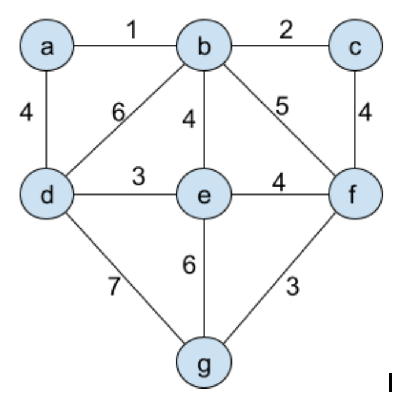

Simulacro examen (práctica VI)
==============================

Pregunta
--------

Tenemos una clase `Perro` con la interfaz indicada. Implementar una función ordenar mediante burbuja que ordene un vector de perros de mayor a menor según su número de identificación (chip).

Nota.- Se pueden añadir funciones a la clase `Perro` si se considera necesario.

```cpp
class Perro{
  private:
    std::string nombre;
    int chipID;

  public:
    Perro(std::string name, int chip);

    int getChipID() const ;
    std::string getNombre() const ;
};

void bubble_sort(std::vector<Perro>& jauria);
```

### Solución:

La alternativa más sencilla es sobrecargar un operador de comparación en la clase `Perro` e
implementar el algoritmo de la burbuja:

```cpp
#include <string>
#include <iostream>
#include <vector>

class Perro{
  private:
    std::string nombre;
    int chipID;

  public:
    Perro(std::string name, int chip) : nombre(name), chipID(chip) {};
    bool operator>(const Perro& other) {
        return chipID > other.chipID;
    }
    int getChipID() const { return chipID; };
    std::string getNombre() const { return nombre; };
};

void bubble_sort(std::vector<Perro>& jauria) {
  for (int i=0; i<jauria.size()-1; i++) {
    for (int k=0; k<jauria.size()-1; k++) {
      if (jauria[k] > jauria[k+1]) {
        std::swap(jauria[k], jauria[k+1]);
      }
    }
  }
}

int main() {
    std::vector<Perro> jauria;
    jauria.push_back(Perro("Rufo", 123));
    jauria.push_back(Perro{"Toby", 856});
    jauria.push_back(Perro{"Zarza", 564});

    bubble_sort(jauria);
    for (auto item: jauria) {
        std::cout << item.getChipID() << std::endl;
    }
}
```


Pregunta
--------

En el fichero adjunto se implementa una búsqueda binaria de manera iterativa. Se pide implementar el mismo algoritmo de forma recursiva.

```cpp
#include <iostream>
#include <vector>
#include <algorithm>

using namespace std;

int BusquedaBinariaIterativa(const std::vector<int>& v, int valorAbuscar)
{
    int primero{0}, ultimo=v.size()-1;
    int medio = (primero+ultimo)/2;
    
    while (primero<=ultimo) {
        if (v.at(medio)<valorAbuscar) {
           primero=medio+1;
        }
        else if(v.at(medio)>valorAbuscar) {
           ultimo = medio - 1;
        }
        else {//son iguales => Encontrado
           return medio;
        }
        medio = (primero+ultimo)/2;
    }
    
    // Not found
    return -1;
}

int main()
{
    std::vector<int> miVec{4,2,7,9,1,3,500,-123,0};
    //Para implmentar la búsqueda binaria el vector tiene que estar ordenado
    std::sort(miVec.begin(), miVec.end());
    //Despues de ejecutar std::sort MiVec quedará ordenado de menor a mayor
    
    int IndiceBusqueda = BusquedaBinariaIterativa(miVec, 500);
    if(IndiceBusqueda == -1) {
        std::cout << "Valor no encontrado" << std::endl;
    }
    else {
        std::cout << "El valor esta en la posicion: " << IndiceBusqueda<<std::endl;
    }
    return 0;
}
```

Pregunta
--------

Se pide implementar un método para recorrer un árbol binario en anchura (recorrido BFS) de tal forma que se pueda construir una lista que contenga los nodos del árbol en el orden en que se han visitado.

Para ello se utilizarán las clases que se proporcionan en los ficheros adjuntos:

* `BinaryTree.h` : contiene la interfaz de las clases con las que se construye el árbol
* `Collections.h` : contiene algunas estructuras de datos (listas, pilas y colas) que podrán utilizarse para resolver el ejercicio

Pistas:

 * En primer lugar deberá implementarse la función bfs de la clase BinaryTree de tal forma que se visiten los nodos en el orden adecuado

   ```cpp
   void BinaryTree::bfs(std::function<void (const TipoDato&)> action) const {
      /*.... */
   }
   ```

 * En segundo lugar, la implementación de la función lambda deberá ser tal que permita obtener la lista que pide el enunciado.
   
   ```cpp
   int main() {
      BinaryTree tree;
      LinkedList list;

      tree.bfs( /* your lambda here */ );

      // Now the `list` contains all the nodes from the tree in BFS order
   }
   ```

**`BinaryTree.h`**
```cpp
#pragma once

#include <memory>
#include <functional>

class ElementoArbolBinario {
    public:
        // Members
        TipoDato dato;
        std::shared_ptr<ElementoArbolBinario> left = nullptr;
        std::shared_ptr<ElementoArbolBinario> right = nullptr;
    public:
        // Constructor 
        ElementoArbolBinario(const TipoDato& dato_) : dato{dato_} {};
};


class BinaryTree {
    protected:
        std::shared_ptr<ElementoArbolBinario> root = nullptr;
 
    public:
        BinaryTree(const TipoDato& dato);  // Creates a tree with a value

        // Breadth first search (recorrido en anchura)
        void bfs(std::function<void (const TipoDato&)> action) const;
};
```

**`Collections.h`**
```cpp
#pragma once

#include <memory>

class ElementListaSimple {
    public:
        // Members
        TipoDato dato;
        std::shared_ptr<ElementListaSimple> next = nullptr;
    public:
        // Constructor 
        ElementListaSimple(const TipoDato& dato_) : dato{dato_} {};
};


// Una lista simple enlazada
class LinkedList {
    public:
        LinkedList();

        void push_back(const TipoDato& dato);
    
    protected:
        std::shared_ptr<ElementListaSimple> front = nullptr;
};


// Una pila
class Stack {
    public:
        Stack();

        int size() const;
        bool empty() const;

        void push(const TipoDato& dato);
        void pop() const;
        TipoDato& top() const;
    protected:
        std::shared_ptr<ElementListaSimple> front = nullptr;
};


// Una cola
class Queue {
    public:
        Queue();

        int size() const;
        bool empty() const;

        TipoDato& front() const;
        TipoDato& back() const;

        void push(const TipoDato& dato);
        void pop();
    protected:
        std::shared_ptr<ElementListaSimple> _front = nullptr;
        std::shared_ptr<ElementListaSimple> _back = nullptr;
};
```

Pregunta
--------

Dibujar el montículo de máximos (a mayor valor, mayor prioridad) que se va obteniendo a medida que se realizan los siguientes pasos:
 * Insertar nodo 26
 * Insertar nodo 12
 * Insertar nodo 24
 * Insertar nodo 30
 * Insertar nodo 28
 * Insertar nodo 15
 * Insertar nodo 20
 * Insertar nodo 21
 * Sacar nodo máx
 * Sacar nodo máx


Pregunta
--------

Para el siguiente grafo, obtener un árbol de expansión mínimo siguiendo el algoritmo de Prim. Deberá explicarse el orden en que se van eligiendo los nodos y las aristas y, finalmente, indicar el peso del árbol de cobertura obtenido 


